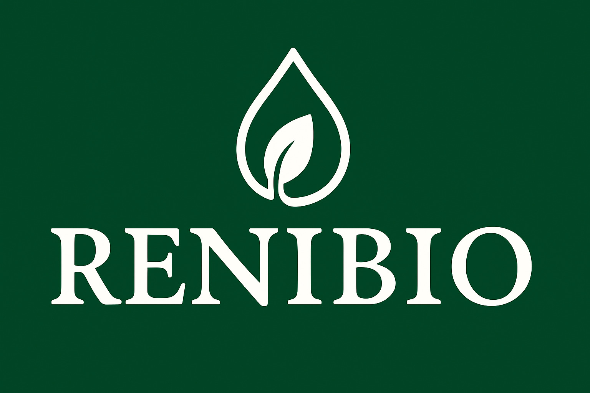
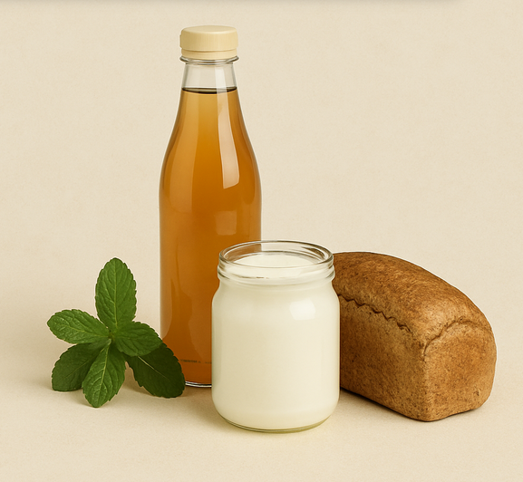

<div align="center">
  
  
  # 🥗 Reni Bio - Produtos Naturais
  
  <b>Site moderno, responsivo e integrado ao WhatsApp para venda de produtos naturais.</b>
  <br><br>
  
</div>

---

## ✨ Características

✔️ <b>Design Moderno:</b> Layout clean e atrativo<br>
✔️ <b>Responsivo:</b> Desktop, tablet e mobile<br>
✔️ <b>WhatsApp:</b> Botões de compra integrados<br>
✔️ <b>Imagens Reais:</b> Galeria de fotos dos produtos<br>
✔️ <b>Animações Suaves:</b> Efeitos visuais modernos<br>
✔️ <b>SEO:</b> HTML semântico e otimizado<br>
✔️ <b>Performance:</b> Carregamento rápido

---

## 🛒 Produtos

| Produto             | Descrição         | Preço    |
|---------------------|-------------------|----------|
| 🧃 Kombucha 500ml   | Garrafa           | R$ 10,00 |
| 🥛 Kefir 300ml      | Pote              | R$ 10,00 |
| 🍞 Pão Integral 500g| Pão artesanal     | R$ 15,00 |

---

## 📚 Seções do Site

- **Home:** Apresentação da marca e produtos
- **Produtos:** Catálogo com preços e botões de compra
- **Como Usar:** Instruções de uso para cada produto
- **Contato:** Informações de contato e atendimento
- **Receitas:** Sugestões de uso dos produtos

---

## 📸 Adicionando Imagens dos Produtos

<details>
<summary><b>Ver instruções de imagens</b></summary>

### Estrutura de Pastas

```text
images/
├── kombucha/
│   ├── 1.jpeg
│   ├── 2.jpeg
│   └── 3.jpeg
├── kefir/
│   ├── 1.jpeg
│   └── 2.jpeg
├── pao/
│   ├── 1.jpeg
│   ├── 2.jpeg
│   └── 3.jpeg
```

### Como nomear as fotos

- Para UMA foto: `1.jpeg`
- Para várias fotos: `1.jpeg`, `2.jpeg`, `3.jpeg`...

### 💡 Dicas de fotos

| Produto   | Sugestão de Fotos                |
|-----------|----------------------------------|
| Kombucha  | Garrafa, detalhe, em uso         |
| Kefir     | Pote fechado, textura            |
| Pão       | Pão inteiro, fatia, ingredientes |

### 🎨 Recomendações

- Formato: JPG ou PNG
- Tamanho: 400x400px
- Peso: até 500KB
- Boa iluminação

### ⚡ Galeria Inteligente

- 1 foto: sem navegação
- 2+ fotos: carrossel automático/manual
- Fallback: mostra ícone se não houver foto

</details>

---
```
site renibio/
├── images/
│   ├── kombucha-1.jpg       # Foto principal
│   ├── kombucha-2.jpg       # Foto adicional (opcional)
│   ├── kombucha-3.jpg       # Foto adicional (opcional)
│   ├── kefir-1.jpg          # Foto principal
│   ├── kefir-2.jpg          # Foto adicional (opcional)
│   └── pao-integral-1.jpg   # Foto principal
│   └── pao-integral-2.jpg   # Foto adicional (opcional)
│   └── pao-integral-3.jpg   # Foto adicional (opcional)
├── index.html
├── style.css
└── script.js
```

### Como Adicionar as Fotos

#### 📌 **Para UMA foto por produto:**
Salve apenas com o número "1":
- `kombucha-1.jpg`
- `kefir-1.jpg`
- `pao-integral-1.jpg`

#### 📌 **Para MÚLTIPLAS fotos por produto:**
Salve numerando sequencialmente:
- `kombucha-1.jpg` (foto principal - produto inteiro)
- `kombucha-2.jpg` (detalhe - rótulo ou textura)
- `kombucha-3.jpg` (em uso - pessoa bebendo)

### 🎯 **Sistema de Galeria Inteligente**

✅ **Recursos automáticos:**
- **Carrossel automático**: Muda a foto a cada 5 segundos
- **Navegação manual**: Setas aparecem ao passar o mouse
- **Indicadores**: Pontos mostram quantas fotos tem
- **Responsivo**: Funciona em celular e desktop
- **Fallback**: Se não há fotos, mostra o ícone

✅ **Controles disponíveis:**
- **Setas laterais**: Para navegar entre fotos
- **Pontos indicadores**: Para ir direto a uma foto
- **Auto-play**: Para mostrar todas as fotos automaticamente

### 💡 **Sugestões de Fotos por Produto**

**Kombucha:**
1. `kombucha-1.jpg` - Garrafa completa
2. `kombucha-2.jpg` - Detalhe do líquido/cor
3. `kombucha-3.jpg` - Sendo servida/consumida

**Kefir:**
1. `kefir-1.jpg` - Pote fechado
2. `kefir-2.jpg` - Textura/consistência

**Pão Integral:**
1. `pao-integral-1.jpg` - Pão inteiro
2. `pao-integral-2.jpg` - Fatia cortada
3. `pao-integral-3.jpg` - Ingredientes/textura

### 🎨 **Formato recomendado das imagens**:
- **Formato**: JPG ou PNG
- **Tamanho**: 400x400px (quadrada)
- **Peso**: Máximo 500KB para carregamento rápido
- **Qualidade**: Boa resolução, bem iluminada

### ⚡ **Sistema Inteligente:**
- Se você adicionar só 1 foto, não aparece navegação
- Se adicionar 2+ fotos, aparece o carrossel completo
- Se alguma foto não carregar, ela é ignorada automaticamente
- Se nenhuma foto carregar, mostra o ícone padrão

## Configuração

### Personalização do WhatsApp

No arquivo `script.js`, altere o número do WhatsApp na linha 2:

```javascript
const WHATSAPP_NUMBER = '5565999999999'; // Substitua pelo número real
```

### Personalização de Contatos

No arquivo `index.html`, atualize as informações de contato:

- Telefone
- E-mail
- Instagram
- Endereço (se necessário)

## Tecnologias Utilizadas

- HTML5
- CSS3 (Flexbox, Grid, Animations)
- JavaScript (ES6+)
- Font Awesome (Ícones)
- Google Fonts (Poppins)

## Recursos Implementados

- Menu hambúrguer para mobile
- Botão flutuante do WhatsApp
- Smooth scrolling
- Animações de entrada
- Efeitos hover
- Menu ativo baseado na seção visível
- Suporte a imagens com fallback
- Totalmente responsivo

## Como Usar

1. Faça o upload dos arquivos para seu servidor web
2. **Adicione as fotos dos produtos** na pasta `images/`
3. Personalize as informações de contato
4. Substitua o número do WhatsApp
5. Teste a funcionalidade

## Suporte

Site desenvolvido por Luanna - [@dev.luanna](https://www.instagram.com/dev.luanna)

---

© 2025 Reni Bio - Produtos Naturais
#
